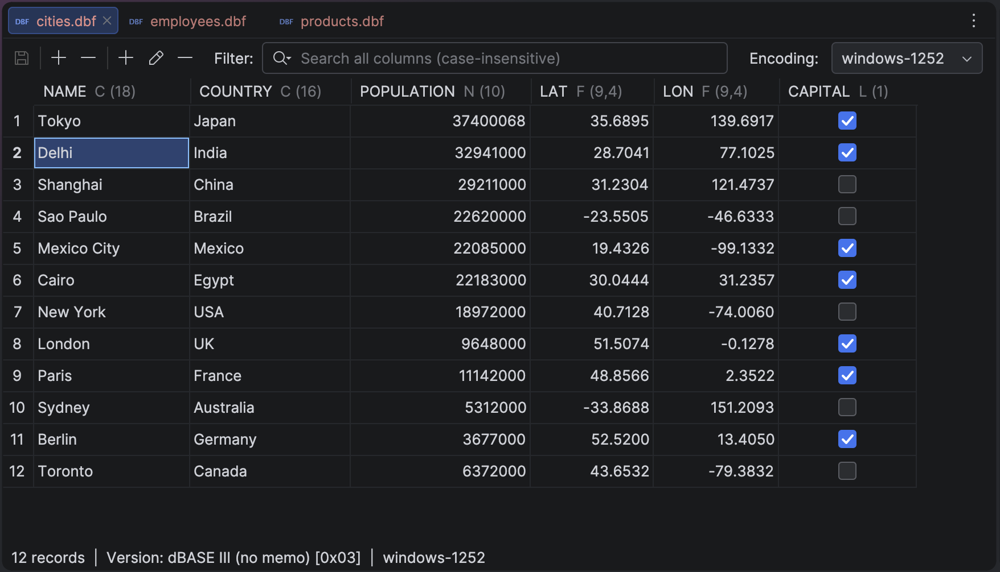

# DBF Reader — DBF table editor plugin for IntelliJ IDEA & other JetBrains IDEs

An IntelliJ Platform plugin (IntelliJ IDEA and other JetBrains IDEs) that opens dBASE/xBase `.dbf`
files in a **table editor** for viewing and editing — instead of showing them as raw binary. DBF
parsing is delegated to the [javadbf](https://github.com/albfernandez/javadbf) library.



## Features

- **Table editor** — `.dbf` files open as a grid (records as rows, fields as columns), with a
  pinned row-number gutter and a status bar showing the record count, the DBF format variant
  (header version byte) and the active encoding.
- **Cell editing** for the `C`, `N`, `F`, `L` and `D` field types, with type-aware editors and
  validation. Logical (`L`) columns use a checkbox; date (`D`) cells offer a calendar picker
  alongside keyboard entry.
- **Find in table** (the IDE Find shortcut, e.g. Cmd-F) — highlights every matching cell, steps
  through matches with an "N of M" counter, and supports Match Case, Whole Words, regular
  expressions and an optional row filter that hides non-matching rows.
- **Go to Column** (the File Structure shortcut, e.g. Cmd-F12) — a speed-search popup listing
  every field; pick one to jump to its column.
- **Copy as TSV** (the IDE Copy shortcut, e.g. Cmd-C) — copies the selected cells to the
  clipboard as tab-separated text, exactly as displayed.
- **Row operations** — add and delete records.
- **Column operations** — add, delete, or edit a column's name, data type and size
  (length/decimals), with best-effort conversion of existing values (unconvertible values are
  cleared).
- **Encoding handling** — pick the charset from a combo box (UTF-8, windows-1251, IBM866/cp866,
  windows-1252, ISO-8859-1) or let the plugin auto-detect it from the DBF language-driver byte. A
  configurable default (Settings | Tools | DBF Reader) is used when a file declares no code page.
- **Safe saving** — the whole file is rewritten via javadbf on an explicit Save (toolbar button or
  the Save-All shortcut). If another program changed the file on disk since it was opened, Save
  detects it and offers to overwrite or reload. If the file contains records marked as deleted
  (which are not shown and would be dropped by the rewrite), Save asks for confirmation first.
  Optionally, a one-time `<name>.dbf.bak` backup is created before the first overwrite (off by
  default; toggle in settings).
- **Read-only for unsupported types** — memo and extended field types are shown read-only. Since
  javadbf can only write `C`, `N`, `F`, `L` and `D` columns, Save is disabled while any
  non-writable column is present; converting such a column to a writable type re-enables it.

## Installation

Build the distribution and install it from disk:

```bash
./gradlew buildPlugin
```

Then in the IDE: **Settings | Plugins | ⚙ | Install Plugin from Disk…** and pick the `.zip` from
`build/distributions/`. Open any `.dbf` file to launch the table editor.

## Building from source

The Gradle wrapper drives everything:

```bash
./gradlew build          # compile + test + build the plugin distribution
./gradlew runIde         # launch a sandbox IDE with the plugin loaded
./gradlew test           # run unit tests
./gradlew verifyPlugin   # IntelliJ Plugin Verifier (compatibility check)
./gradlew buildPlugin    # plugin .zip under build/distributions/
```

Implemented in **Java** (`src/main/java`). Targets IntelliJ IDEA 2024.2+ (`sinceBuild = 242`, open
`untilBuild`).

## License

This plugin is licensed under the [MIT License](./LICENSE).

It bundles the [javadbf](https://github.com/albfernandez/javadbf) library
(`com.github.albfernandez:javadbf`), used **unmodified** and **dynamically linked** as a separate
JAR, under the [GNU LGPL-3.0](https://www.gnu.org/licenses/lgpl-3.0.html) license. The third-party
attribution and the full license texts are provided in
[THIRD-PARTY-NOTICES.md](./THIRD-PARTY-NOTICES.md) and the [`licenses/`](./licenses) directory, and
ship inside the plugin distribution alongside the bundled library.